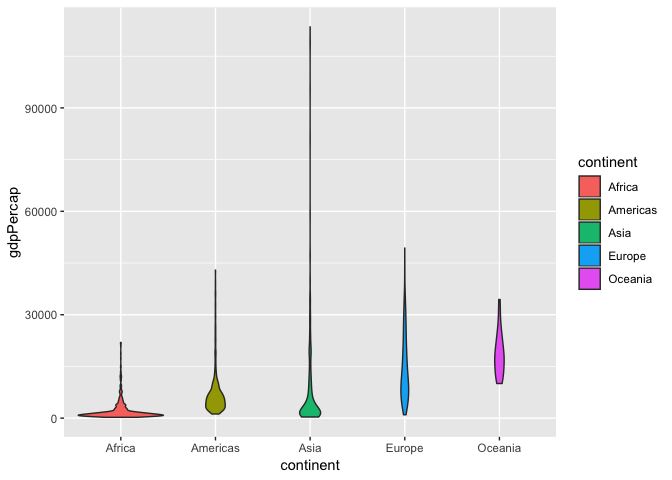
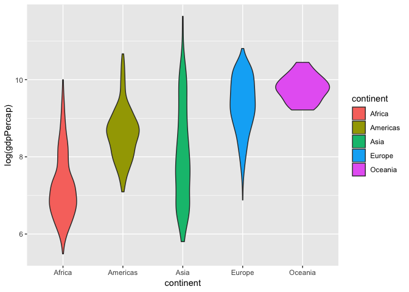
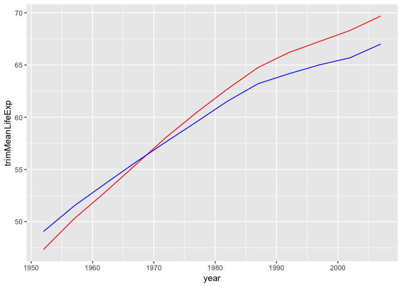
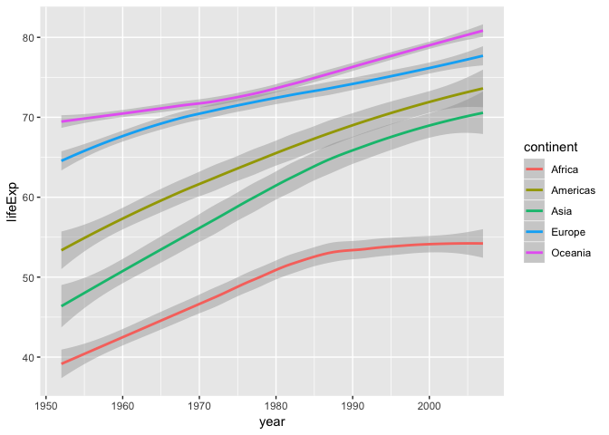
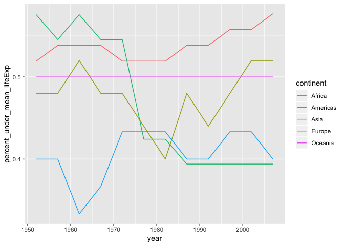

Hw03
================
Vetle Birkeland Huglen
1 10 2018

``` r
suppressPackageStartupMessages(library(tidyverse))
```

    ## Warning: package 'ggplot2' was built under R version 3.4.4

``` r
suppressPackageStartupMessages(library(gapminder))
```

Firstly we look at the distribution of gdpPercap by continent. We can make a table showing som key values, and also violin plots, which are really nice for summarising a distribution.

``` r
gdp_overview <- gapminder %>%
  group_by(continent) %>%
  summarize(max_gdpPercap = max(gdpPercap),
              min_gdpPercap = min(gdpPercap),
              gdpSpread = max_gdpPercap-min_gdpPercap)
```

    ## Warning: package 'bindrcpp' was built under R version 3.4.4

``` r
knitr::kable(gdp_overview)
```

| continent |  max\_gdpPercap|  min\_gdpPercap|  gdpSpread|
|:----------|---------------:|---------------:|----------:|
| Africa    |        21951.21|        241.1659|   21710.05|
| Americas  |        42951.65|       1201.6372|   41750.02|
| Asia      |       113523.13|        331.0000|  113192.13|
| Europe    |        49357.19|        973.5332|   48383.66|
| Oceania   |        34435.37|      10039.5956|   24395.77|

``` r
gapminder %>% 
  group_by(continent) %>%
  ggplot(aes(continent, gdpPercap, fill = continent)) +
  geom_violin()
```

 The violin plots are really dragged out. This case may be better visualised by using a log function on the values:

``` r
gapminder %>% 
  group_by(continent) %>%
  ggplot(aes(continent, log(gdpPercap), fill = continent)) +
  geom_violin()
```

 Now lets look at a way of removing outliers from a statistic. We can compare the so called trimmed mean to the regular mean, to see if there is a big difference.

``` r
gapminder %>%
  group_by(year) %>%
  summarize(trimMeanLifeExp = mean(lifeExp, trim=0.25),
            regMeanLifeExp = mean(lifeExp)) %>%
  ggplot() +
  geom_line(aes(year, trimMeanLifeExp), color = 'red') +
  geom_line(aes(year, regMeanLifeExp), color = 'blue')
```

 Here follows a simple plot of how the life expectancy has changed over the years in each continent. I really like the geom\_smooth function, since it also show the variance of the data.

``` r
gapminder %>%
  group_by(continent) %>%
  ggplot(aes(year, lifeExp)) +
  geom_smooth(aes(colour = continent))
```

    ## `geom_smooth()` using method = 'loess' and formula 'y ~ x'



``` r
  #geom_bar(stat = "identity", aes(fill = continent))
```

And now to the fourth task. I found this one really hard, but I dont really know why. Now that its working, it seems to be in a very intuitive way. The table and graph shows the number and percentage of countries below the mean life expectancy in their respective continents, for each year.

``` r
countries_under_mean <- gapminder %>%
  group_by(year, continent) %>%
  summarise(mean = mean(lifeExp),
            n_under_mean = sum(lifeExp < mean),
            percent_under_mean_lifeExp = n_under_mean/n())

knitr::kable(countries_under_mean)
```

|  year| continent |      mean|  n\_under\_mean|  percent\_under\_mean\_lifeExp|
|-----:|:----------|---------:|---------------:|------------------------------:|
|  1952| Africa    |  39.13550|              27|                      0.5192308|
|  1952| Americas  |  53.27984|              12|                      0.4800000|
|  1952| Asia      |  46.31439|              19|                      0.5757576|
|  1952| Europe    |  64.40850|              12|                      0.4000000|
|  1952| Oceania   |  69.25500|               1|                      0.5000000|
|  1957| Africa    |  41.26635|              28|                      0.5384615|
|  1957| Americas  |  55.96028|              12|                      0.4800000|
|  1957| Asia      |  49.31854|              18|                      0.5454545|
|  1957| Europe    |  66.70307|              12|                      0.4000000|
|  1957| Oceania   |  70.29500|               1|                      0.5000000|
|  1962| Africa    |  43.31944|              28|                      0.5384615|
|  1962| Americas  |  58.39876|              13|                      0.5200000|
|  1962| Asia      |  51.56322|              19|                      0.5757576|
|  1962| Europe    |  68.53923|              10|                      0.3333333|
|  1962| Oceania   |  71.08500|               1|                      0.5000000|
|  1967| Africa    |  45.33454|              28|                      0.5384615|
|  1967| Americas  |  60.41092|              12|                      0.4800000|
|  1967| Asia      |  54.66364|              18|                      0.5454545|
|  1967| Europe    |  69.73760|              11|                      0.3666667|
|  1967| Oceania   |  71.31000|               1|                      0.5000000|
|  1972| Africa    |  47.45094|              27|                      0.5192308|
|  1972| Americas  |  62.39492|              12|                      0.4800000|
|  1972| Asia      |  57.31927|              18|                      0.5454545|
|  1972| Europe    |  70.77503|              13|                      0.4333333|
|  1972| Oceania   |  71.91000|               1|                      0.5000000|
|  1977| Africa    |  49.58042|              27|                      0.5192308|
|  1977| Americas  |  64.39156|              11|                      0.4400000|
|  1977| Asia      |  59.61056|              14|                      0.4242424|
|  1977| Europe    |  71.93777|              13|                      0.4333333|
|  1977| Oceania   |  72.85500|               1|                      0.5000000|
|  1982| Africa    |  51.59287|              27|                      0.5192308|
|  1982| Americas  |  66.22884|              10|                      0.4000000|
|  1982| Asia      |  62.61794|              14|                      0.4242424|
|  1982| Europe    |  72.80640|              13|                      0.4333333|
|  1982| Oceania   |  74.29000|               1|                      0.5000000|
|  1987| Africa    |  53.34479|              28|                      0.5384615|
|  1987| Americas  |  68.09072|              12|                      0.4800000|
|  1987| Asia      |  64.85118|              13|                      0.3939394|
|  1987| Europe    |  73.64217|              12|                      0.4000000|
|  1987| Oceania   |  75.32000|               1|                      0.5000000|
|  1992| Africa    |  53.62958|              28|                      0.5384615|
|  1992| Americas  |  69.56836|              11|                      0.4400000|
|  1992| Asia      |  66.53721|              13|                      0.3939394|
|  1992| Europe    |  74.44010|              12|                      0.4000000|
|  1992| Oceania   |  76.94500|               1|                      0.5000000|
|  1997| Africa    |  53.59827|              29|                      0.5576923|
|  1997| Americas  |  71.15048|              12|                      0.4800000|
|  1997| Asia      |  68.02052|              13|                      0.3939394|
|  1997| Europe    |  75.50517|              13|                      0.4333333|
|  1997| Oceania   |  78.19000|               1|                      0.5000000|
|  2002| Africa    |  53.32523|              29|                      0.5576923|
|  2002| Americas  |  72.42204|              13|                      0.5200000|
|  2002| Asia      |  69.23388|              13|                      0.3939394|
|  2002| Europe    |  76.70060|              13|                      0.4333333|
|  2002| Oceania   |  79.74000|               1|                      0.5000000|
|  2007| Africa    |  54.80604|              30|                      0.5769231|
|  2007| Americas  |  73.60812|              13|                      0.5200000|
|  2007| Asia      |  70.72848|              13|                      0.3939394|
|  2007| Europe    |  77.64860|              12|                      0.4000000|
|  2007| Oceania   |  80.71950|               1|                      0.5000000|

``` r
countries_under_mean %>%
  ggplot(aes(year, percent_under_mean_lifeExp)) +
  geom_line(aes(colour = continent))
```


